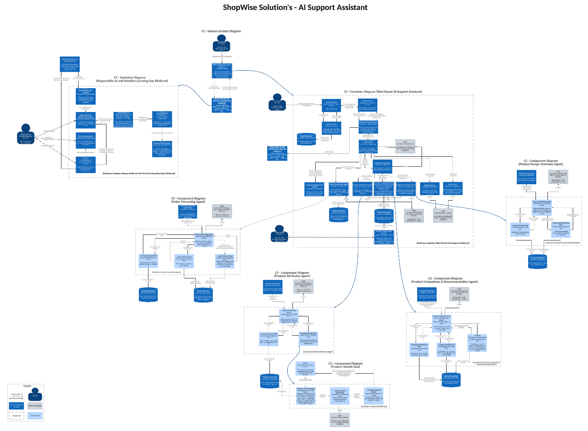

# ShopWise AI Support Assistant - C4 Architecture

  

This document provides a concise overview of the end-to-end C4 architecture for the **ShopWise AI Support Assistant**, covering System Context, Containers, and Components.

📄 [View the full architecture PDF here](../images/architecture/c4-architecture-ai-assistant.pdf)

---

## C1 - System Context Diagram

### **Overview**

The AI Support Assistant is a web-based system that offers intelligent support for:

- **Order Inquiries**
- **Product Inquiries**
- **Product Comparisons**
- **Product Recommendations**
- **Product Range Overview**

### **Actors and Interactions**

1. **Customer**: Interacts with the AI assistant via a chat interface.
2. **ML Engineers and Data Scientists**: Monitor and fine-tune AI models.
3. **Responsible AI Platform**: Platform that oversees performance, compliance, and ethical AI standards.

---

## C2 - Container Diagrams

### **Key Containers**

### C2 - Container Diagram - Web-Based AI Support Assistant

1. **Login Web UI** handles user authentication and provides tokens for user sessions.
2. **Chat UI** manages the chat interface using WebSockets for real-time interactions.
3. **API Gateway** validates user sessions and forwards requests to backend services.
4. **Session Management Service** tracks user sessions and manages context for multi-turn conversations.
5. **Customer Support Supervisor** orchestrates interactions by routing queries to the appropriate agents or services.
6. Agents for order management, product handling, and fallback ensure seamless query handling.
7. The **Responsible AI Platform** monitors and validates AI assistant activities.

### C2 - Container Diagram - Responsible AI & Machine Learning Ops Platform

1. **Data Sanitization Pipeline** preprocesses input data to ensure quality.
2. **Responsible AI Monitoring Service** tracks and evaluates the AI system for bias and compliance.
3. **Fine-tuned Dataset** provides datasets for model improvement.
4. **Evaluation Pipelines** assess the performance of models and agents.
5. Future components like **Dashboards** and **Alerts** enhance monitoring and reporting.

---

## C3 - Component Diagram

### **Key Agents and Their Roles**

1. **Order Processing Agent**:
   - **Order Details Tool**: Retrieves specific order information.
   - **Order History Tool**: Tracks order status and returns eligibility.

2. **Product Attribute Agent**:
   - **Product Details Tool**: Provides filtered search results based on attributes like price, rating, and category.

3. **Product Comparison & Recommendation Agent**:
   - **Comparison Tool**: Enables side-by-side product evaluations.
   - **Recommendation Tool**: Suggests similar products tailored to user preferences.

4. **Product Range Overview Agent**:
   - **Aggregated Statistics Tool**: Uses tool to generate summaries. It provides filtered lists of products tailored to user-defined criteria.

---

## Future Enhancements

- **Responsible AI Dashboard**: For ethical and performance metrics visualization.
- **Real-Time Alerts**: To flag anomalies or risks in AI performance.
- **Advanced Fine-Tuning Pipelines**: To improve the assistant's conversational abilities.

---

This modular architecture ensures scalability, flexibility, and adherence to responsible AI practices.
