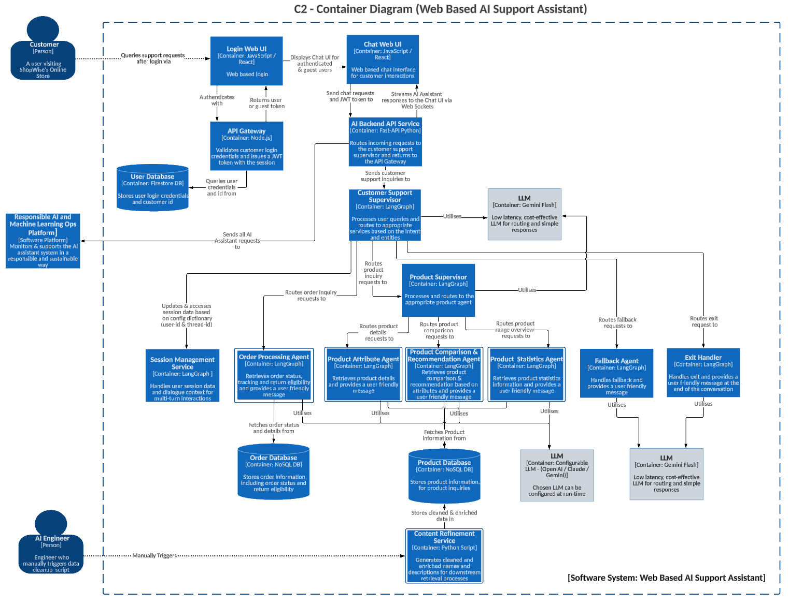

# C2 - Container Diagram - Web-Based AI Support Assistant

This diagram details the container-level architecture for the AI Support Assistant:

1. **Login Web UI** handles user authentication and provides tokens for user sessions.
2. **Chat UI** manages the chat interface using WebSockets for real-time interactions.
3. **API Gateway** validates user sessions and forwards requests to backend services.
4. **Session Management Service** tracks user sessions and manages context for multi-turn conversations.
5. **Customer Support Supervisor** orchestrates interactions by routing queries to the appropriate agents or services.
6. **Agents** for order management, product handling, and fallback ensure seamless query handling.
7. The **Responsible AI Platform** monitors and validates AI assistant activities.
