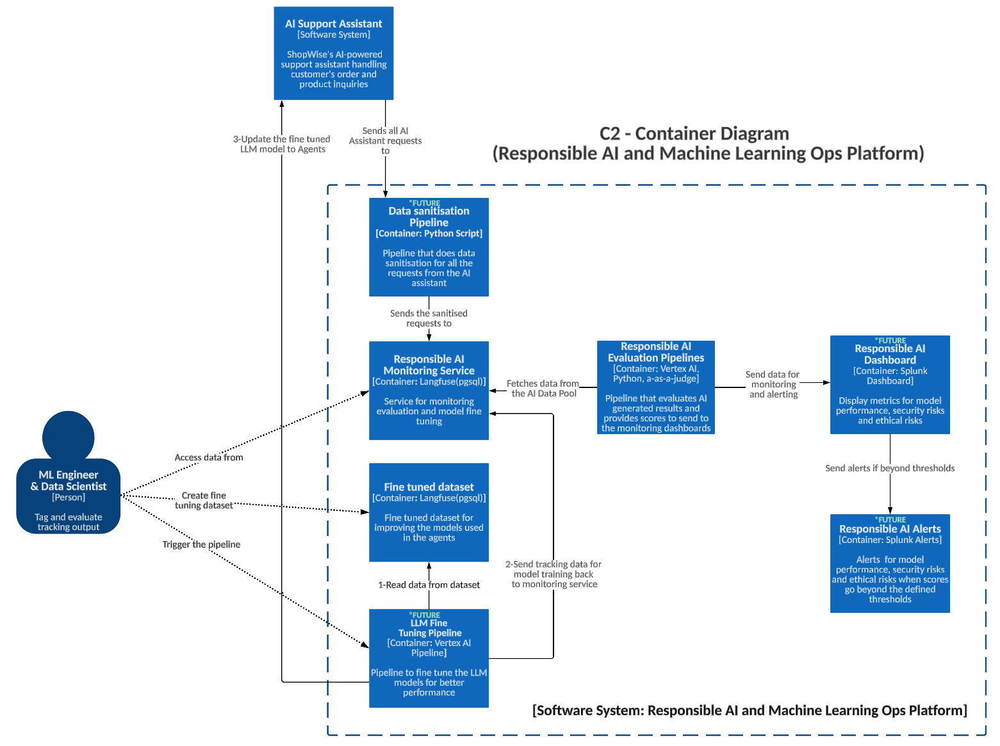

# C2 - Container Diagram - Responsible AI & Machine Learning Ops Platform

This diagram depicts the Responsible AI Monitoring Platform's components:

1. **Data Sanitization Pipeline** preprocesses input data to ensure quality.
2. **Responsible AI Monitoring Service** tracks and evaluates the AI system for bias and compliance.
3. **Fine-tuned Dataset Service** generates tuning datasets for model improvement.
4. **Evaluation Pipelines** assess the performance of models and agents.
5. Future components like **Dashboards** and **Alerts** enhance monitoring and reporting.
