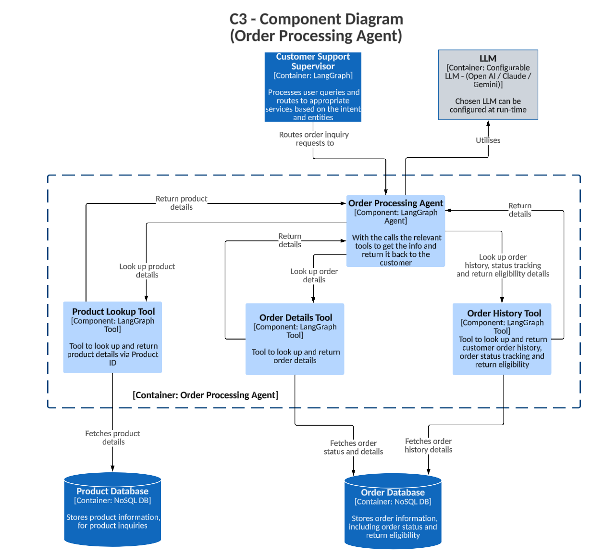

# C3 - Component Diagram - Order Processing Agent

This diagram describes the Order Processing Agent's architecture:

1. **Customer Support Supervisor** routes order-related queries to the agent.
2. The agent uses:
   - **Order Details Tool** to fetch order status based on Order ID.
      - Returns the specific order metadata from the **Order Database**.
      - A check is applied to ensure the order belongs to the given customer.
   - **Order History Tool** for return eligibility and tracking details based on Customer ID.
      - Returns the entire order history for the given customer from the **Order Database**.
   - **Product Lookup Tool** to fetch product information based on Product ID.
      - Returns the specific product details from the **Product Database**.
