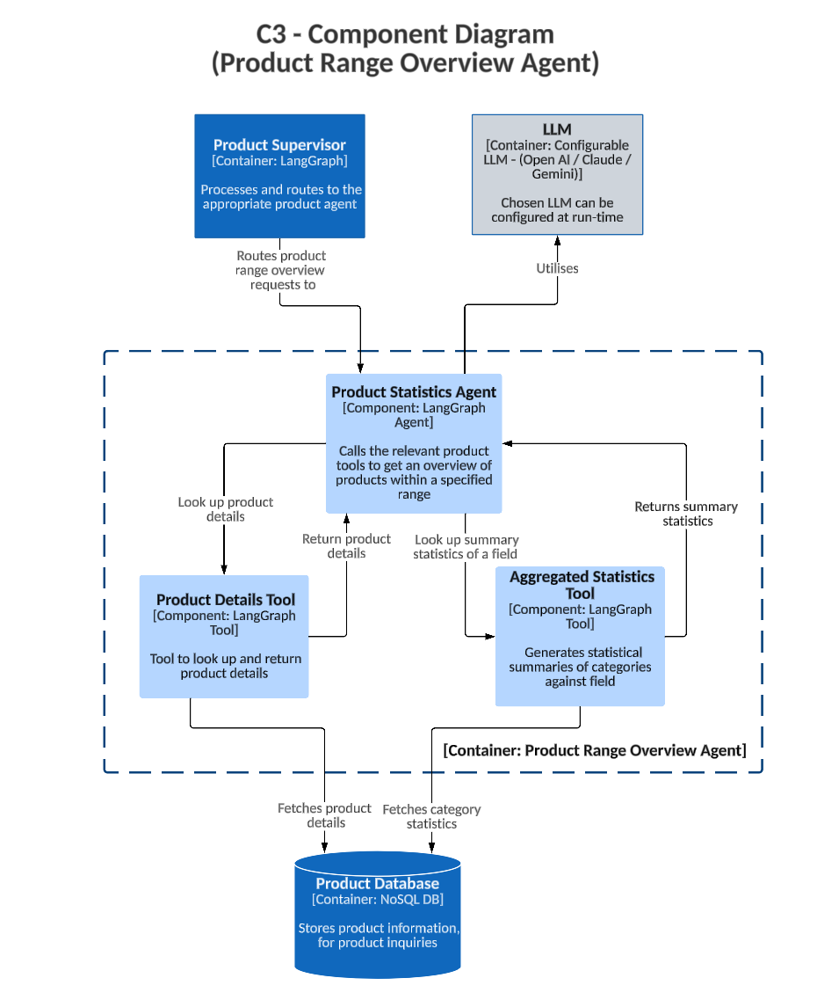

# C3 - Component Diagram - Product Range Overview Agent

This diagram details the Product Range Overview Agent:

1. **Product Supervisor** routes range overview queries.
2. The agent:
   - Uses **Aggregated Statistics Tool** to generate summaries.
      - Returns the aggregated summary statistics from the **Product Database**, broken down by category and specified by field (e.g. rating, price).
   - If necessary, uses **Product Details Tool** to fetch further details on products.
      - Returns the product details from the **Product Database** based on the filtered semantic search results.
      - This is necessary if the user asks a follow-up question about a product in a certain price range, for example.