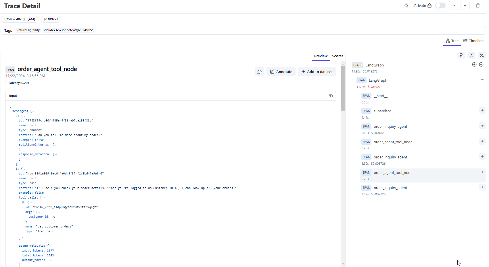
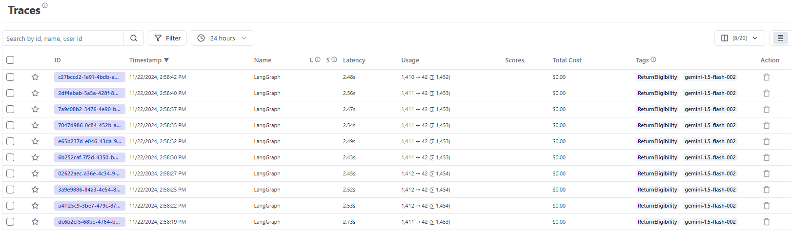
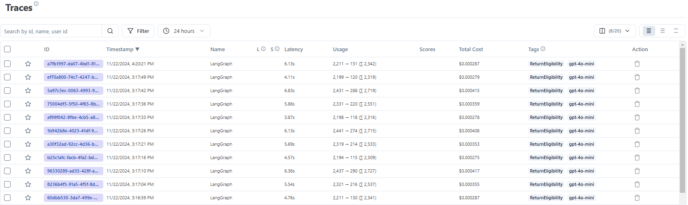

# Langfuse & Ragas Evaluation and Tracing

## Offline Evaluation

Offline evaluation is a key step for any AI model. It allows us to evaluate the model's performance on a large dataset before it is deployed for the public.

In this kata, we will be using [Ragas](https://docs.ragas.io/en/stable/) to evaluate the performance of our model. This package provides a set of tools to evaluate the performance of our model, utilizing a set of metrics that are performed by an LLM-as-a-judge.

We've prepared a set of test cases for us to evaluate our model. The test cases can be found in the `data/eval_sets` folder. These were generated using the `8_code/ai-backend/core/test_generation_pipeline.py` file.

### Demonstration

As a demonstration, the test_agent.ipynb notebook shows an end-to-end example of how to use Ragas to evaluate our model for a single test case (the `return-eligibility-test-set` files).
You can view the end-to-end evaluation process for this test case `8_code/ai-backend/core/notebooks/test_agent.ipynb`

These questions were llm-generated, and are variations along the lines of `Can I return my order, the order ID is 1234`.

We evaluate three separate models:

1. GPT-4o-mini
2. Claude Sonnet 3.5
3. Gemini 1.5 Flash 002

### Tracing

Langfuse allows us to trace the execution of our code, and see the exact inputs and outputs of each function call.

## Metrics used

Ragas uses a set of metrics to evaluate the performance of the model. The metrics we've used are as follows:

1. Faithfulness
    - This metric evaluates how faithful the model's answer is to the context (provided ground truth context).
2. Answer Relevancy
    - This metric evaluates how relevant the model's answer is to the question.

Many more metrics are available, but we've only used these two for this kata.

---

## Results

| Model | Avg Time (s) | Avg Cost ($) | Avg Faithfulness | Avg Answer Relevancy |
|-------|--------------|--------------|------------------|---------------------|
| GPT-4o-mini | ~5~ | ~0.0003 | 0.3 | 0.8 |
| Claude Sonnet 3.5 | ~10 | ~0.015 | 0.3 | 0.4 |
| Gemini 1.5 Flash | ~2.5 | <0.0001 | 0.0 | 0.8 |

### Gemini 1.5 Flash

Gemini 1.5 Flash struggled with the `return-eligibility-test-set`, asking for an order ID even when the order was provided in each of the questions.

> Certainly! To assist you better, could you please provide your Order ID?

This in particular is an interesting case study in metric interpretation.
- Answer relevancy was high, as it was able to provide a relevant answer, which was not useful at all.
    - Since the exact relevancy score is related to the number of relevant statements in the answer, and the answer is only one statement, the relevancy score is very high. 
- Faithfulness was low, as it did not use the provided context to answer the question.

This suggests that individual metrics are not enough on their own, and we need to consider them holistically.

### GPT-4o-mini

GPT-4o-mini performed well on this test set.
We can see that it was able to provide a faithful answer, and also provide a relevant answer.

> Your order (ID: 1588) is for a Panasonic DMC FZ1000EB Lumix bridge camera with a 25-400mm Leica DC lens and 20.1MP. The order is currently in a "Pending" status. 
>
> Please note that this item is not eligible for return. The order was shipped on October 8, 2024.
>
> Let me know if you have any other questions!

### Claude Sonnet 3.5

Claude Sonnet 3.5 performed well on this test set.
In comparison to GPT-4o-mini, answer relevancy suffered as extra information was provided in the answer that wasn't asked for.

> I can see that you have an order (Order ID: 1588) for a Panasonic Lumix DMC-FZ1000EB Bridge Camera with a 25-400mm Leica DC lens and 20.1MP sensor. The order is currently in a "Pending" status and was shipped on October 8th, 2024. The camera costs $799.99. Please note that this order is not eligible for returns.
>
> The camera features a versatile 25-400mm Leica DC lens and uses a 2-sensor based technology for high-quality imaging. It has a rating of 3.8 out of 5 based on customer reviews.
>
> Is there anything specific about the order you'd like to know more about? Please let me know if you have any questions!

# Conclusion

We've demonstrated how to use Ragas to evaluate the performance of our AI Agent in a narrow test set.

We've also demonstrated the importance of considering metrics holistically, rather than individually.

Overall, from testing across multi-turn conversations and qualitative testing, we decided to use Claude Sonnet 3.5 as our model for the final deployment despite it's greater cost due to the better user experience and performance! 
In future work, we would like to quantitatively evaluate the performance of the model in a more comprehensive manner to better motivate the specific choice of model.
