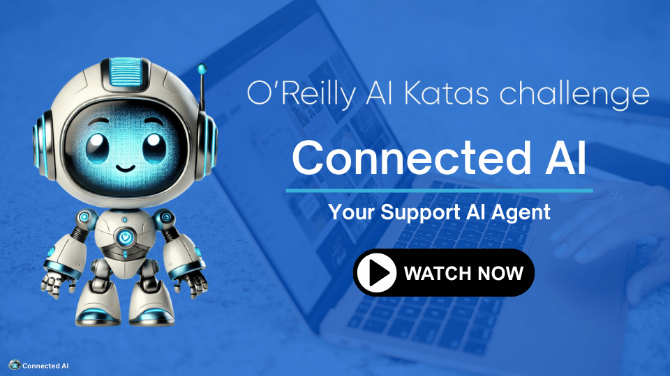
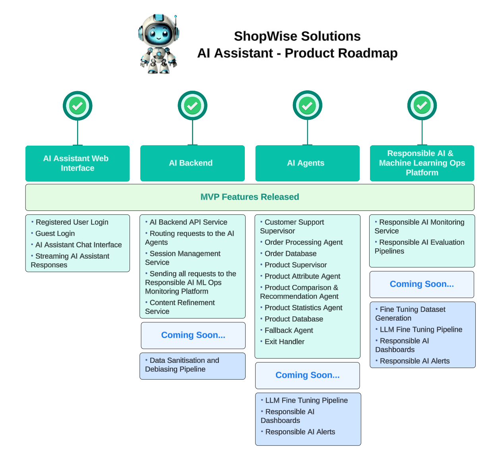
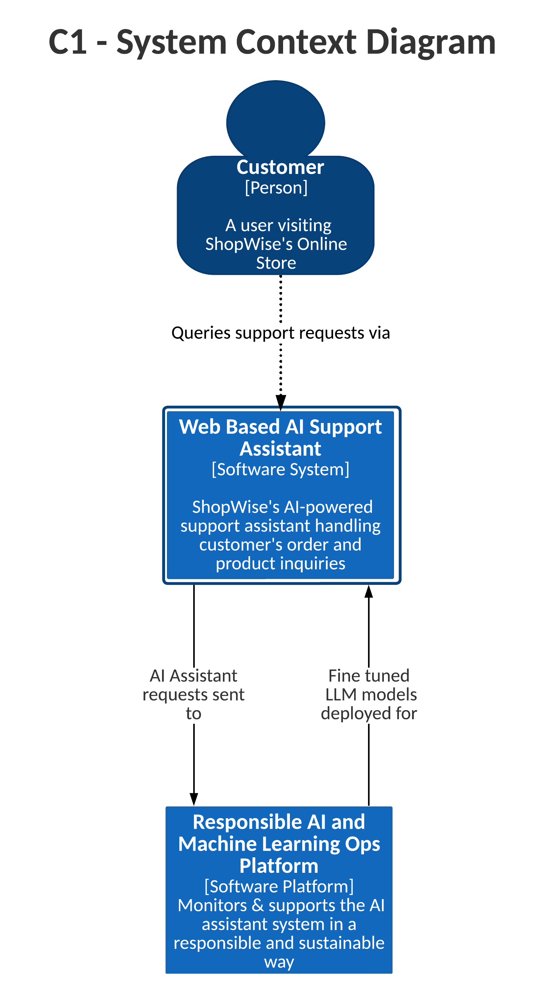
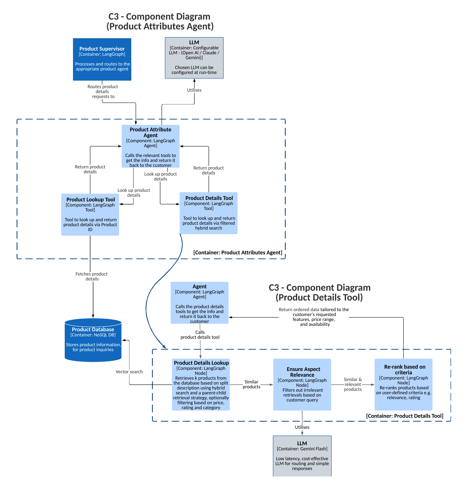
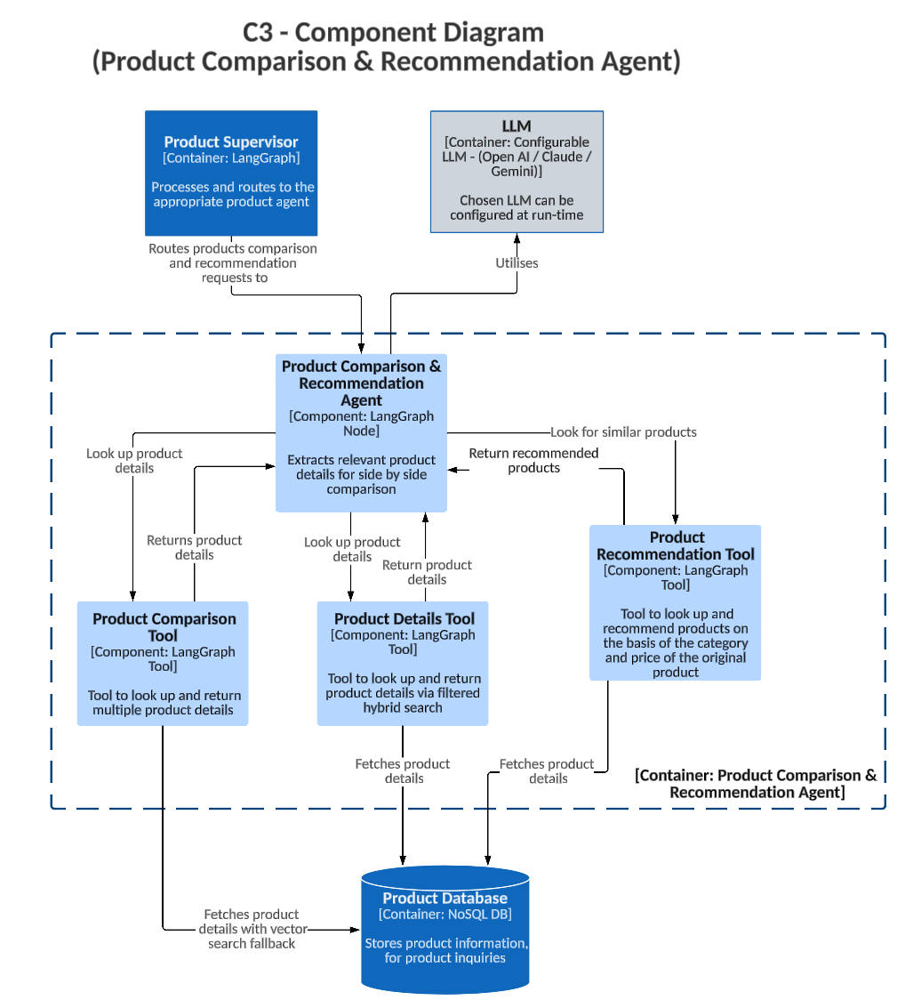
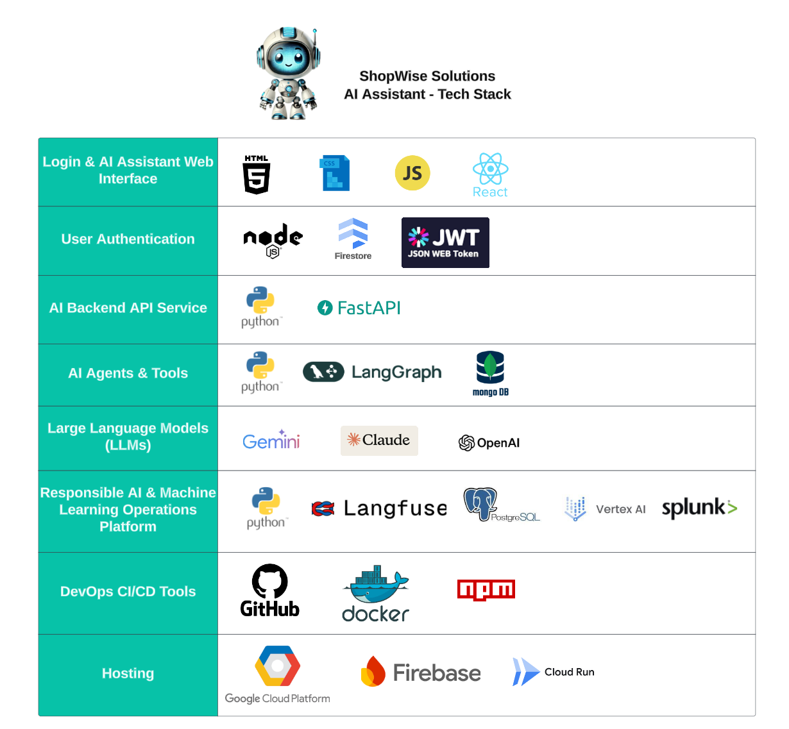

# **Connected AI Team's - ShopWise AI Assistant Agent** 
 

  
     
  <a href="https://vimeo.com/1035054086" alt="Connected AI - O'Reilly AI Katas Challenge Presentation Video">Click to watch our presentation video for the O'Reilly AI Katas Challenge</a>
    
  <a href="https://vimeo.com/1032143843" alt="Connected AI - AI Agent Demo">Click to watch our AI Agent Demo</a>

### Welcome to the **ShopWise AI Assistant** repository! 

This project is designed to deliver ShopWise Solution's AI Support Assistant which serves as the first line of support on our online e-commerce store, handling customer inquiries on products, orders, returns and refunds while seamlessly integrating with our company’s database. This AI-driven solution is designed to streamline customer interactions through advanced Natural Language Understanding (NLU), managing product inquiries, order tracking, and return eligibility via personalised, multi-turn conversations. With real-time access to product and order information, the AI assistant enables efficient comparisons, tailored recommendations and instant product availability checks.

This expansion into AI-powered support reflects ShopWise Solution's commitment to delivering an exceptional customer experience and reliable service across its diverse catalogue, which includes electronics, apparel, home goods, and more.

---

## 📋 **Table of Contents**

- [📖 Overview](#-overview)
  - [About the Project](#about-the-project)
  - [Team Members](#-team-members)
- [📝 Requirements](#-requirements)
  - [Functional Requirements](#functional-requirements)
  - [Non-Functional Requirements](#non-functional-requirements)
  - [Assumptions and Constraints](#assumptions-and-constraints)
- [🚀 Features and Roadmap](#-features-and-roadmap)
  - [Features](#features)
  - [Product Roadmap](#product-roadmap)
- [🔷 Architecture and Design](#-architecture-and-design)
  - [C4 Architecture](#c4-architecture)
  - [System Context Diagram](#system-context-diagram)
  - [Container Diagrams](#container-diagrams)
  - [Component Diagrams](#component-diagrams)
- [📊 Architecture Decision Records (ADRs)](#-architecture-decision-records-adrs)
- [💻 Tech Stack](#-tech-stack)
- [🧪 Test Cases](#-test-cases)
- [🛠️ Deployment](#%EF%B8%8F-deployment)

---

## 📖 **Overview**

### About the Project

The **ShopWise AI Assistant** is an innovative AI solution that provides the first line of support on our e-commerce platform, streamlining customer interactions with personalised AI assistance for product inquiries, order management, and returns through seamless real-time data integration. it enables:

- ✅ **Personalised Recommendations**
- 🗣️ **Multi-Turn Conversations** with contextual understanding
- 📊 **Real-Time Product Comparisons** and availability checks
- 🚚 **Seamless Order Management** (tracking, returns, and shipping)

---

### 🌟 **Team Members** 

Hi! We are the **"ConnectedAI Team"** – a group of innovative minds from **Woolworths Group, Australia**.

-  **[Abhinav Singh](https://www.linkedin.com/in/init-abs)** - Senior ML Engineer  
-  **[Kenichi Nakanishi](https://www.linkedin.com/in/kenichinakanishi)** - Lead Data Scientist  
-  **[Meena Kasi](https://www.linkedin.com/in/meenakasi/)** - Solutions Architect  
-  **Xun Zhou** - ML Engineer Manager  
-  **[Yogesh Pathade](https://www.linkedin.com/in/yogeshpathade/)** - Tech Lead  

---

## 📝 **Requirements** 

### Functional Requirements
📄 [View Functional Requirements](1_requirements/01-functional-requirements.md)  
Defines core features like **Natural Language Understanding**, product comparisons, and order management.

### Non-Functional Requirements
📄 [View Non-Functional Requirements](1_requirements/02-non-functional-requirements.md)  
Outlines performance benchmarks, accuracy, and system usability requirements.

### Assumptions and Constraints
📄 [View Assumptions and Constraints](1_requirements/03-assumptions-and-constraints.md)  
Details the foundational assumptions and system limitations.

---

## 🚀 **Features and Roadmap** 

### Features
📄 [View Features](2_features_and_roadmap/features.md)  
Lists all the features of the Web Based AI Assistant System.

### Product Roadmap
📄 [View Product Roadmap](2_features_and_roadmap/product-roadmap.md)  
Details the MVP release and future enhancements.
  

---

## 🔷 **Architecture and Design** 

### C4 Architecture

Provides an end-to-end architectural view of the AI Assistant System.

  

### C4 Architecture Legend

Below is the legend used for our C4 Architecture Diagrams

  

---

### System Context Diagram

---

Provides an overview of how users and external systems interact with the Core System.

[📄 View Details](3_architecture_and_design/c1-system-context.md)

  

---

### Container Diagrams

---

#### 1. **AI Assistant System Container Diagram**

Illustrates the containers that make up the core AI Assistant.

[📄 View Details](3_architecture_and_design/c2-container-ai-assistant-system.md)

---

#### 2. **Responsible AI ML Ops Platform Container Diagram**

Highlights the Responsible AI Monitoring and MLOps components.

[📄 View Details](3_architecture_and_design/c2-container-responsible-ai-ml-ops-platform.md)

---

### Component Diagrams

---

#### 1. **Order Processing Agent Component Diagram** 

Shows the components involved in order processing.

[📄 View Details](3_architecture_and_design/c3-component-order-processing-agent.md)

---

#### 2. **Product Attributes Agent Component Diagram**

Highlights the components handling product specifications, availability, and attributes.

[📄 View Details](3_architecture_and_design/c3-component-product-attributes-agent.md)

---

#### 3. **Product Comparison and Recommendation Component Diagram**

Details the logic and components used to compare and recommend products.

[📄 View Details](3_architecture_and_design/c3-component-product-comparison-recommendation-agent.md)

---

#### 4. **Product Range Overview Agent Component Diagram** 

Provides an overview of the components managing product statistics and catalog insights.

[📄 View Details](3_architecture_and_design/c3-component-product-range-overview-agent.md)

---

## 📊 **Architecture Decision Records (ADRs)** 

Explore the rationale behind critical architectural decisions in the project.  

### ADRs List

-  📄 [ADR Template](4_adrs/000_adr_template.md)  
-  📄 [NoSQL Database Storage](4_adrs/001_adr_nosql_database_storage.md)  
-  📄 [Pre-Trained Models](4_adrs/002_adr_pre_trained_models.md)  
-  📄 [Custom API Gateway](4_adrs/003_adr_custom_api_gateway.md)  
-  📄 [In-Memory Session Management](4_adrs/004_adr_in_memory_state_session_management.md)  
-  📄 [LangGraph Framework](4_adrs/005_adr_langgraph_framework.md)  
-  📄 [Hosting Decisions](4_adrs/006_adr_hosting.md)  
-  📄 [Evaluation Framework](4_adrs/007_adr_evaulation_framework.md)  
-  📄 [Authentication & Authorization](4_adrs/008_adr_authentication_and_authorization.md)  
-  📄 [GitHub Actions CI/CD](4_adrs/009_adr_github_actions_ci_cd.md)  
-  📄 [Caching Strategy](4_adrs/010_adr_caching.md)  
-  📄 [Containerization](4_adrs/011_adr_containerization.md)  
-  📄 [WebSocket Implementation](4_adrs/012_adr_web_socket_implementation.md)  

---

## 💻 **Tech Stack**
[📄 View Tech Stack](5_tech_stack/tech-stack.md)

  

---

## 🧪 **Test Cases** 

📄 [View Test Cases and Demos](6_test_cases/test-cases.md)  
Detailed test cases for functional and non-functional validation, including:

- Context Understanding
- Product Comparisons
- Order Status and Shipping Queries

#### **Langfuse and Ragas** 

Langfuse and Ragas facilitates observability, metrics, evaluations, prompt management for the AI agent.

📄 [View Evaluation and Tracing](6_test_cases/evaluation.md)  

---

## 🛠️ **Deployment**

📄 [View Deployment Instructions](7_deployment/local-machine-deployment.md)  
Step-by-step guide for running the system on your local machine, including backend and frontend setup.

📄 [View Data Preprocessing and Loading Instructions](7_deployment/data_preprocessing_loading.md)  
Step-by-step guide for data preprocessing and loading.

📄 [View Cloud Hosting Instructions](7_deployment/cloud_hosting_instructions.md)  
Step-by-step guide for hosting the system in the cloud, including backend and frontend setup.
